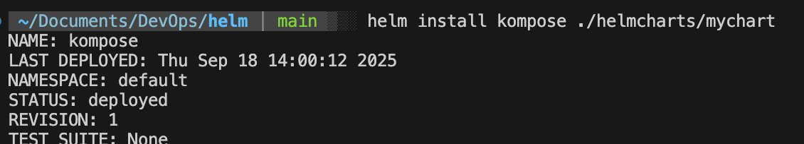

# Desafío 9: Helm chart para app NestJS + MongoDB

Este repo contiene un **Helm chart funcional** que despliega una aplicación basada en NestJS y una base MongoDB. Está pensado para cumplir con los entregables del desafío: código, documentación y evidencia de pruebas.

## Cómo se creó el chart

Para construir este chart seguí un proceso paso a paso:

1. **Crear la carpeta del proyecto**

   ```bash
   mkdir helmcharts
   cd helmcharts
   ```

2. **Generar un chart base con Helm**

   ```bash
   helm create mychart
   ```

   Esto me dio la estructura inicial con `Chart.yaml`, `values.yaml` y la carpeta `templates/`.

3. **Limpiar la plantilla generada**

   * Eliminé todos los manifiestos por defecto dentro de `templates/`.
   * Dejé vacío el `values.yaml`, ya que no iba a usar variables predefinidas.

4. **Incorporar mis propios manifiestos**

   * Copié los manifiestos de Kubernetes que había desarrollado previamente.
   * Los organicé dentro de `helmcharts/mychart/templates/` (app, servicios, base de datos y volúmenes persistentes).

Con este procedimiento logré que el chart se base íntegramente en mis manifiestos personalizados. Esto evita duplicación de código y cumple con el objetivo del desafío: **transformar los recursos en una solución gestionada mediante Helm**.

## Requisitos

* Kubernetes 1.24+
* Helm v3
* `kubectl` configurado contra tu clúster
* Una StorageClass por defecto o un PV definido para MongoDB (si activás persistencia)

## Estructura

```
helm/
├── helmcharts/
│   └── mychart/
│       ├── Chart.yaml
│       ├── values.yaml
│       ├── templates/
│       │   ├── app-deployment.yaml
│       │   ├── app-service.yaml
│       │   ├── db-deployment.yaml
│       │   ├── db-service.yaml
│       │   ├── dbdata-persistentvolumeclaim.yaml
│       │   └── pv-definitions.yaml
└── README.md
```

> Nota: `pv-definitions.yaml` es opcional. Si tu clúster ya tiene **StorageClass por defecto**, podés deshabilitar ese template.

## Instalación rápida

Usaremos un namespace dedicado para que sea fácil limpiar:

```bash
NS=desafio9
kubectl create namespace $NS 2>/dev/null || true
helm install myapp ./helmcharts/mychart -n $NS
```

Verificá el release y los recursos:

```bash
helm list -n $NS
kubectl get pods,svc,pvc -n $NS
```

## Actualizar el release

Luego de editar algún template:

```bash
helm upgrade myapp ./helmcharts/mychart -n $NS
```

## Reinstalar desde cero

```bash
helm uninstall myapp -n $NS
helm install myapp ./helmcharts/mychart -n $NS
```
## Evidencia
### Instalación de Helm


### Recursos desplegados en Kubernetes


### Aplicación web en funcionamiento


